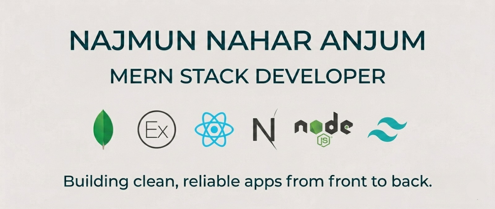

  

<h1 align="center">Hi 👋, I'm Najmun Nahar Anjum</h1>

<h3 align="center">
  
</h3>

  Passionate about building modern, scalable, and user-friendly web applications.

---

## 👨‍💻 About Me

- 👋 I'm **[nnanjum1](https://github.com/nnanjum1)**, a passionate **MERN Stack Developer** from **Sylhet, Bangladesh**.
- 💻 I build responsive full-stack applications using **MongoDB, Express.js, React.js, Next.js, Node.js**, and **Tailwind CSS**.
- 🚀 Currently exploring **advanced Next.js**, improving my **Data Structures & Algorithms** skills through **LeetCode**.
- 🛠️ Familiar with **Firebase Authentication**, **REST APIs**, **JWT**, **Stripe Payment Integration**, and **MongoDB Atlas**.
- 🌐 Explore my **[Portfolio](https://professional-portfolio-omega-tan.vercel.app)**.
- 📫 Reach me at **najmunnanjum121@gmail.com**.

---

## 💻 Tech Stack

### 🎨 Frontend

### ⚙️ Backend

### 🛠️ Tools & Technologies

### 📱 Mobile

---

## 🌐 Connect With Me

&nbsp;&nbsp;

---

## 📊 GitHub Stats

---

  <i>"Code. Learn. Build. Repeat."</i> 🚀

