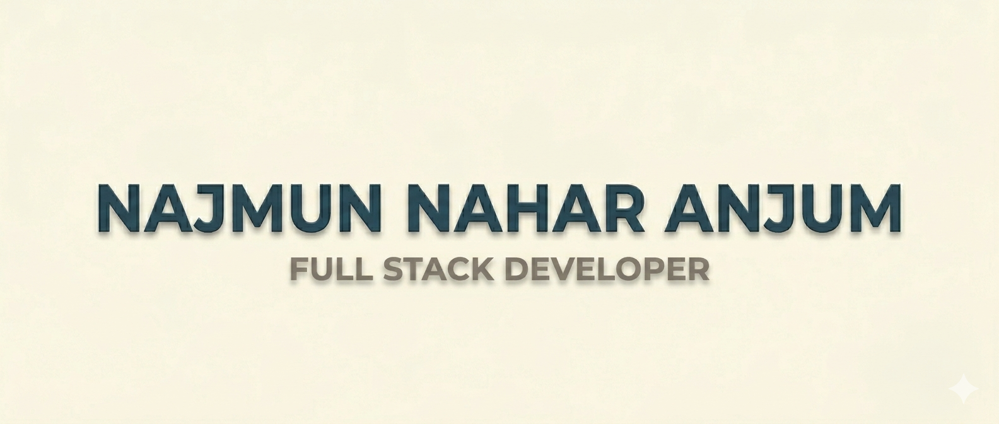

  

### Hi there! 👋  
I'm **Najmun Nahar Anjum**, a **CSE student** and a growing **Web Application Developer** who loves turning ideas into real, working systems. I enjoy building clean, functional projects—whether it's a PHP auth system, a small ML experiment, or a complete app.

---

## 🌐 About Me
- 🎓 Studying CSE and exploring different areas of software development  
- 💻 I mainly work with **HTML, CSS, Bootstrap, PHP, JavaScript**, and **MySQL**  
- 🔐 I enjoy working on authentication, email verification, and building real-world CRUD functionality  
- 🤖 Recently diving into **Machine Learning** (Logistic Regression, Decision Trees, SHAP, XGBoost basics)  
- 📱 Learning mobile development — **Android (Java)** and **Flutter**  
- 🌱 I like learning by building practical projects  

---

## 🔧 Tech Stack

### 🖥️ Frontend
HTML • CSS • Bootstrap • JavaScript  

### 🛠️ Backend
PHP • MySQL • Session/Auth • Tokens • PHPMailer  

### 📊 Machine Learning
NumPy • Pandas • Scikit-Learn • Decision Trees  

### 📱 Mobile
Android (Java, SQLite, Firebase Auth) • Flutter (Beginner)

---

## 🚀 Projects I've Worked On

- 🛒 **Stationery Solutions App** — login, product management, cart & ordering  
- 🏨 **HotelDine (Concept)** — hotel room booking system + admin panel  
- 📬 **PHP Authentication System** — email verification with tokens  
- 📚 **Machine Learning Assignments** — Logistic Regression, PCA, and more  

---

## 📫 Connect With Me  
📧 Email: **najmunnanjum121@gmail.com**  
🔗 LinkedIn: **www.linkedin.com/in/najmunnaharanjum**

---

### ⭐ *Thanks for visiting! Feel free to check out my projects — I’m always building something new.*  
